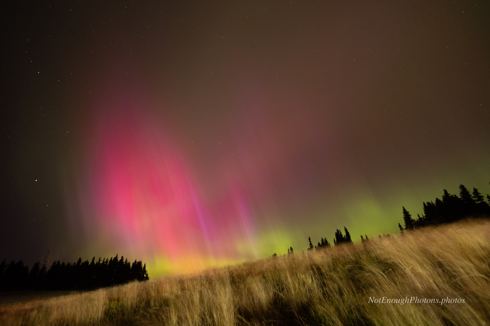

Some of my earliest night photography subjects were auroras. Here's one of my favorite aurora images, from 2024 on Hurricane Ridge in the Olympic National Park. 

True story: I was up there to photograph the Milky Way to the south. But no matter what settings I used, I was getting washed-out junk. Finally I glanced over my shoulder to the north and saw that there was the most beautiful, vibrant aurora going on. OK! Time to turn my tripod around!

In the summer, the Park Service runs a wonderful night sky program on Hurricane Ridge. See the [Park Service's Olympics night sky page](https://www.nps.gov/olym/planyourvisit/nightsky.htm) for details. It's nearly over for 2026, but if the Olympic National Park still exists next year you should check it out.

:::details-box
Unmodified Canon R8, Canon RF 16mm f/2.8 STM lens
:::

