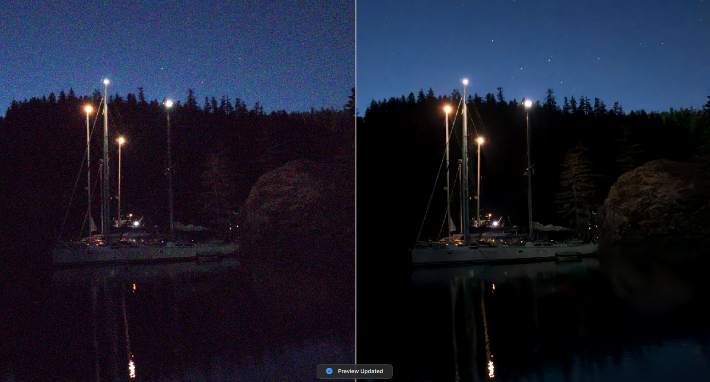
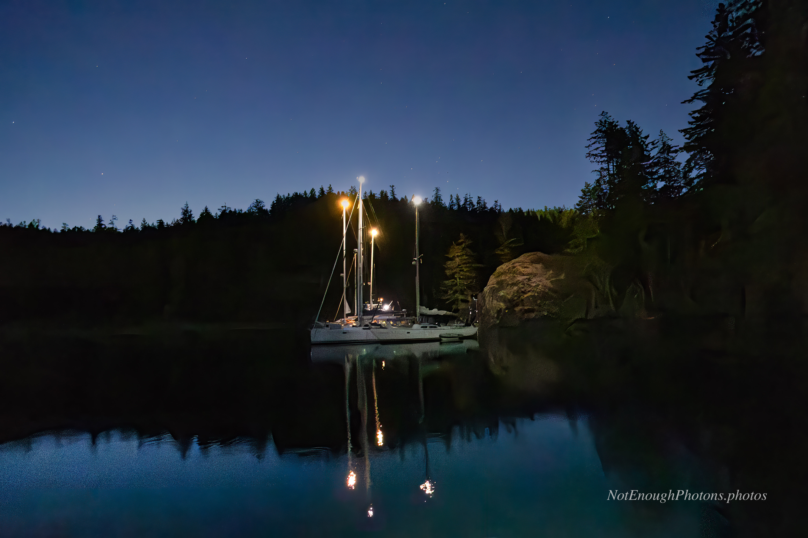

In the summer of 2024, I shot an early-nightfall image of several boat neighbors at our anchorage in Desolation Sound in British Columbia.
Because my boat was moving in the water, I had to use a short exposure of 1/15 of a second to minimize shake. Even though I had a f/2.8 lens, I needed
to compensate for that with a very high ISO of 80000. Mirrorless cameras have made great strides at high ISOs, but they can't work miracles.
The resulting grainy image was pretty terrible.

I thought this would make an interesting test case for noise reduction tools. Could post-processing software rescue something this bad? Yes, yes it can.

And here's the final image. It wouldn't survive a tight crop, but it is miles above what I started with.

:::details-box
Unmodified Canon R8, Canon RF 16mm F2.8 STM lens. A single image, processed in Photoshop and Topaz.
:::

