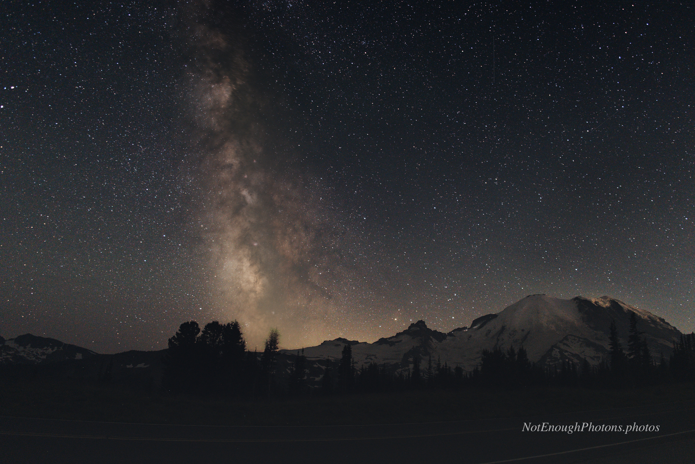

I first got interested in night photography when I saw some amazing Milky Way images, which inspired me to go out and try this for myself. This is one of my earlier efforts, with the Milky Way next to Mount Rainier, captured from Sunrise, Washington. Do you see those tiny specks of light on the left flank of the mountain? Those are climbers starting their summit push. 

This image demonstrates that you don't need expensive gear to do night photography. I created this with a not-fancy mirrorless camera, a reasonably fast prime lens and a tripod.
Afterwards I used a technique called stacking to build a single image from a number of individual images. The benefit to this is that it supresses the random sensor noise inherent in low-light photography. I finished with a little post-stacking touch-up in Photoshop.

:::details-box
Unmodified Canon R8, Canon RF 16mm f/2.8 STM lens. Processed in [Starry Landscape Stacker](https://sites.google.com/site/starrylandscapestacker/home) and Photoshop. This image was made from 22 25-second exposures, for a bit over nine minutes of exposure time in total.
:::

