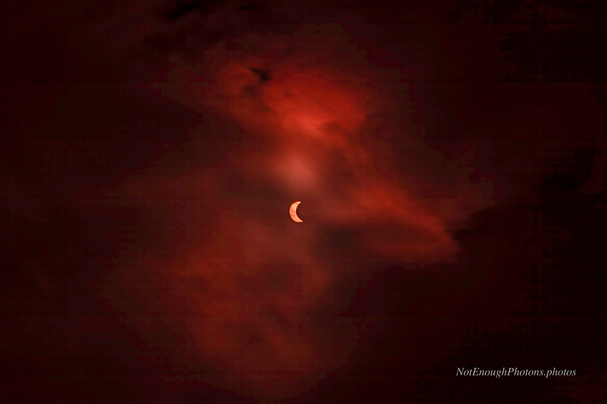

Let me say at the outset that no one who was serious about seeing the August 2026 total solar eclipse looked at the climate maps on [Eclipsophile](https://eclipsophile.com/tse2026/ "2026 TSE climate discusssion") and said to themselves, "baby's going to ICELAND!" Which I suppose means I was not serious, because, dear reader, I *did* go to Iceland.

The [Icelandic Met cloud forecasts](https://en.vedur.is/weather/forecasts/cloudcover/#type=composite) for August 12th did hold out a small sliver of hope, in the form of a small area of clear skies at 17:00, northwest of Bolungarvík in the Westfjords. Clouds were forecast to be thick in the area by 18:00. Totality was at 17:43. Maaaayyyybe?

At 17:30, I was not feeling particularly good about my decision-making.

:::details-box 
Astro-modified Canon R8, Canon RF 100mm-500mm USM lens. Processed in Photoshop.
Note: Because I used an astro-modified body for most of the 2026 solar eclipse images, I color-corrected them in post. But not this one! I love the spooky red cast, so I left it in.
:::
