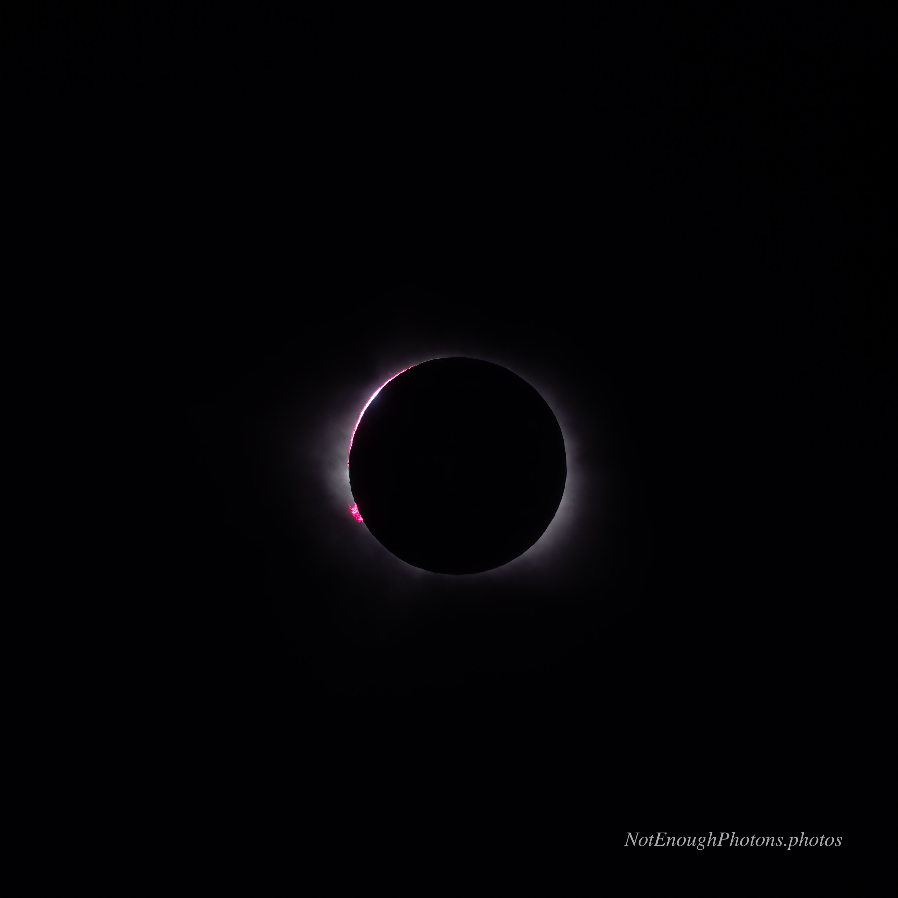

You could see the beautiful chromosphere, where the sun's second layer of atmosphere peeks through on the upper left side.

:::details-box
Astro-modified Canon R8, Canon RF 100mm-500mm USM lens. Processed in Photoshop.
:::
