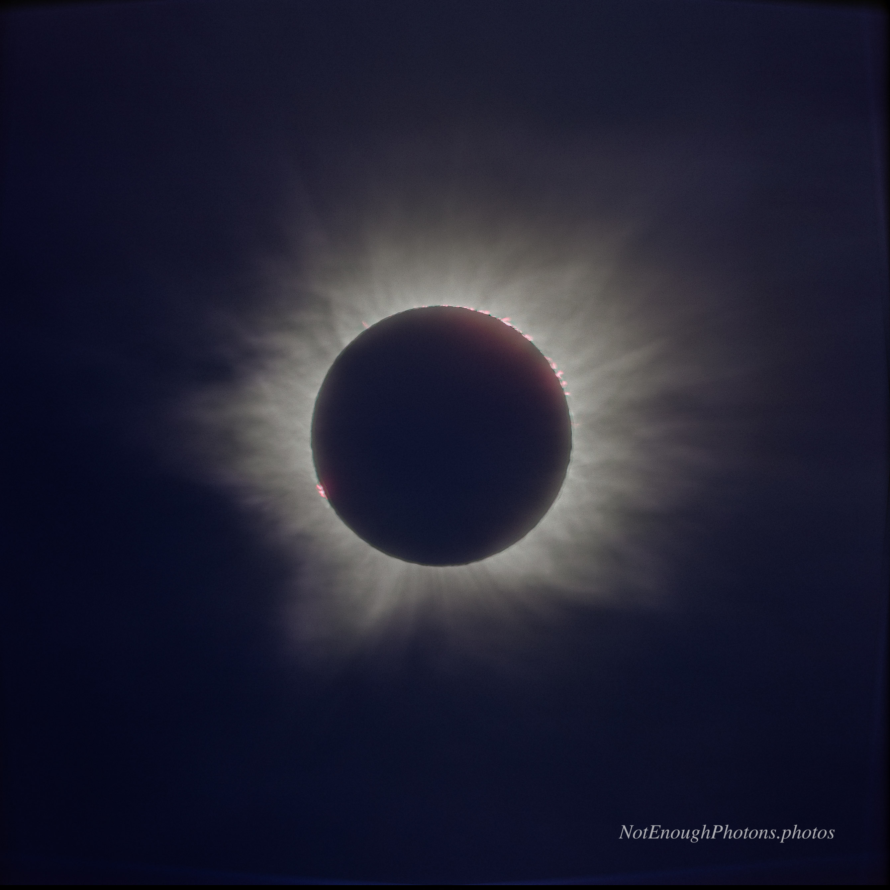

This is a HDR composite of five images, shot at different exposures to capture the dynamic range of the prominences, the inner corona and the outer corona.
You can even make out a little Earthshine.

:::details-box
Astro-modified Canon R8, Canon RF 100mm-500mm USM lens. Processed in Photoshop, mostly following [Naztronomy's Youtube tutorials on creating HDRs with eclipse data](https://www.youtube.com/watch?v=iwCxuDQ2Los). Using the Pellett method really brought out the coronal streamers, which were completely washed out in the raw data.
:::

