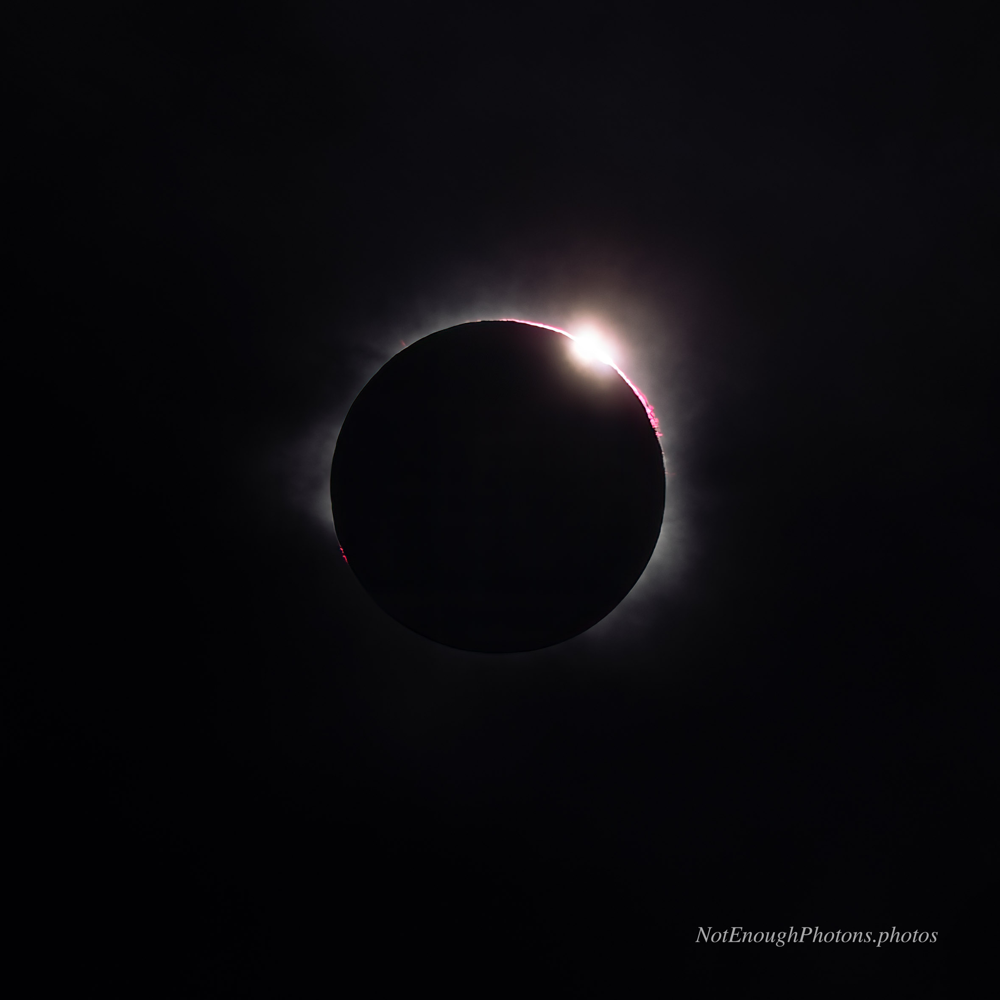

Totality, which had lasted about 90 seconds at the location, was about to end. Another diamond ring appeared.

:::details-box
Astro-modified Canon R8, Canon RF 100mm-500mm USM lens. Processed in Photoshop.
:::
