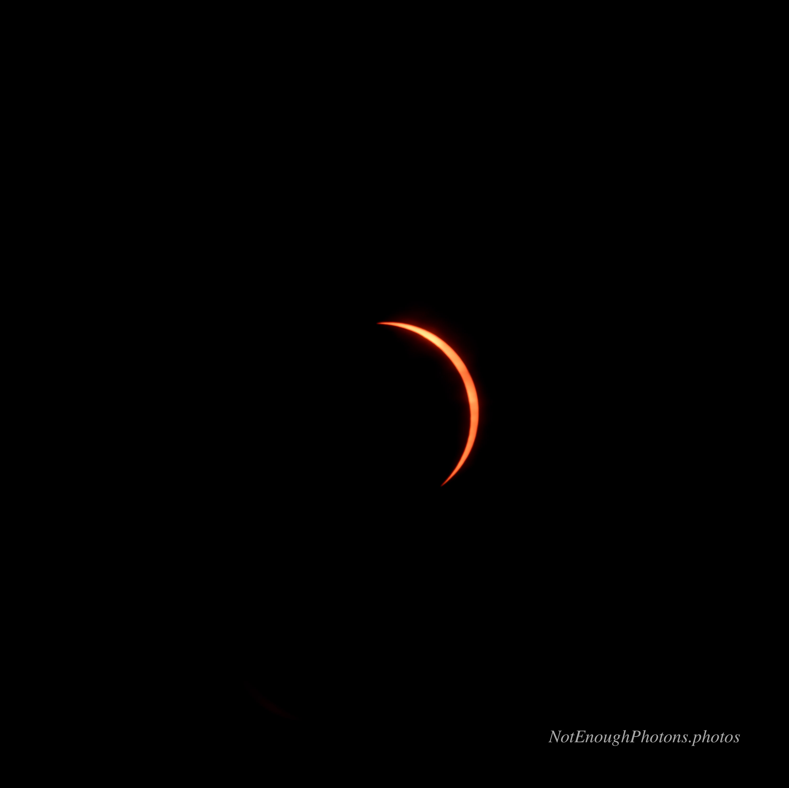

Totality was over. It was time to put our solar glasses back on and put the solar filters back on the cameras.

About five minutes after I took this image, the forecasted dense cloud banks rolled in. You couldn't see a thing.

:::details-box
Astro-modified Canon R8, Canon RF 100mm-500mm USM lens. Processed in Photoshop.
:::
