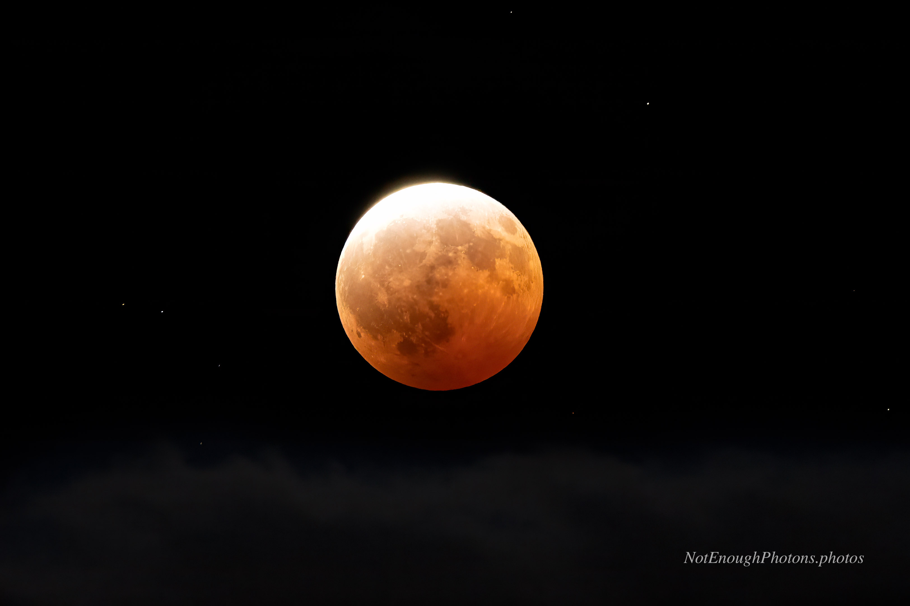

A few weeks later, there was a partial lunar eclipse. "Partial" makes it sound pretty junior league, but in the Americas it was still going to be impressive.

By this time I was back home in Washington State, and was looking at a discouraging weather forecast for the night of August 27th.  I decided that the Olympic Peninsula
was our best shot, and my wife and I drove up to Hurricane Ridge in the Olympic National Park. It looked like pea soup up there. We quickly decided to head back down to Port Angeles, where at least there were some broken clouds.

We set up on Ediz Hook under thick cloud cover and waited. About ten minutes past the maximum, the moon started to poke out from the clouds every now and then. This was our chance.

:::details-box
Unmodified Canon R8, Canon RF 100mm-500mm USM lens. Processed in Photoshop, with denoising and sharpening in Topaz.
:::

