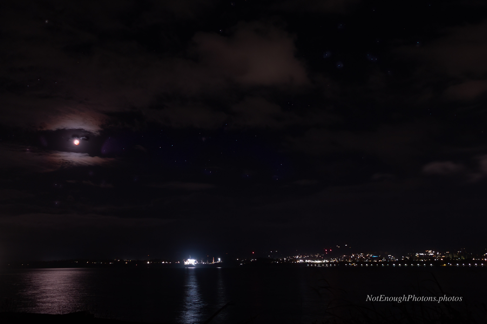

In addition to my long lens setup, I brought along a second camera body and a 16mm lens. My Hurricane Ridge plan had been to make a second wide-angle image of the lunar eclipse on the left and dimmer Milky Way core on the right. Because of the dynamc range I'd have to take multiple shots at different exposure lengths  and then combine them into a composite image. 

However, the best-laid plans of mice and night photographers often go awry, and the chances of picking up the Milky Way core on Ediz Hook looking south are basically non-existent. I put up the second rig and let it fire away, just to see if I could pick up anything. Below is the best shot of the lot.

When I got back to town, I learned that Puget Sound had enjoyed a surprise clear evening and everyone was out taking pictures of the lunar eclipse. My neighbor showed me a beautiful shot that he got in our neighborhood with his birding scope and his phone. LOLsob.

:::details-box
Astro-modified Canon R8, Canon RF 16mm F2.8 STM lens. Processed in Photoshop, with denoising and sharpening in Topaz.
:::

