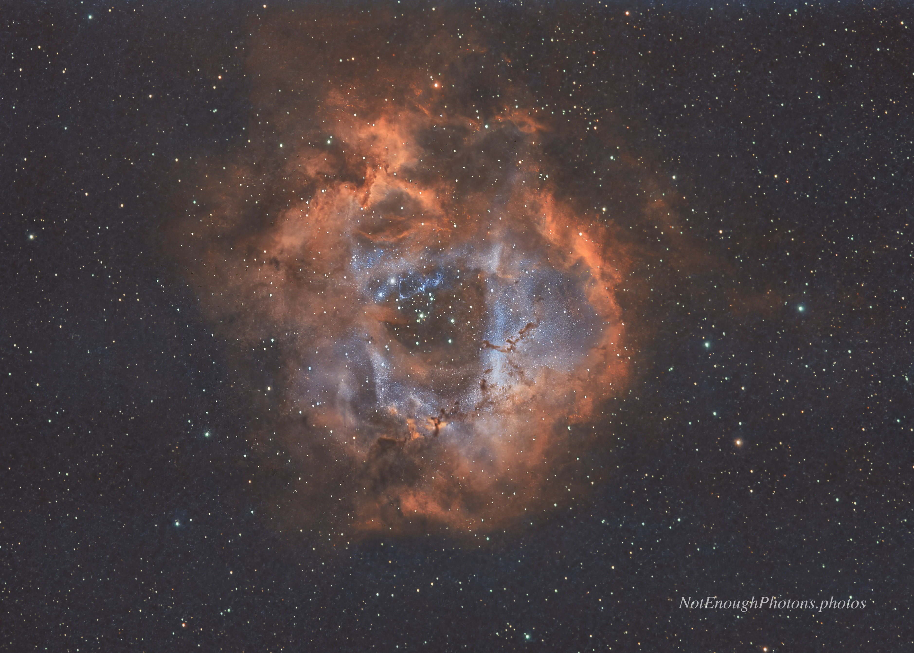

By winter 2025-2026, I was curious about capturing images of deep space objects (DSOs) without a smart telescope. Capturing DSOs involves dfferent photographic techniques and more gear, so the learning curve is steeper here than with other forms of night photography. I'm pretty proud of this Rosette nebula image.

The best part of this image is that I collected this data from my Bortle eighteen bazillion backyard. I was able to do that because narrowband filters can isolate certain emissions from nebulas even when city lights and moon light are factors. Since I had inconveniently-located buildings and trees to work around, it took me four nights to collect enough data to make this image.

:::details-box
Astro-modified Canon R8, Canon RF 100mm-500mm USM lens, Star Adventurer GTI mount, Optolong L-eXtreme dual narrowband filter. To capture enough light, I needed to take three minute exposures. My mount wasn't up to that without help, so I added in a guidecam/scope, the ZWO ASI220 mono mini and ZWO 30mm f/5 mini guide scope. I used [NINA](https://nighttime-imaging.eu/) to manage the data acquisition process. Total integration time was 207 minutes, and I processed the results in [Siril](https://siril.org/).
:::

