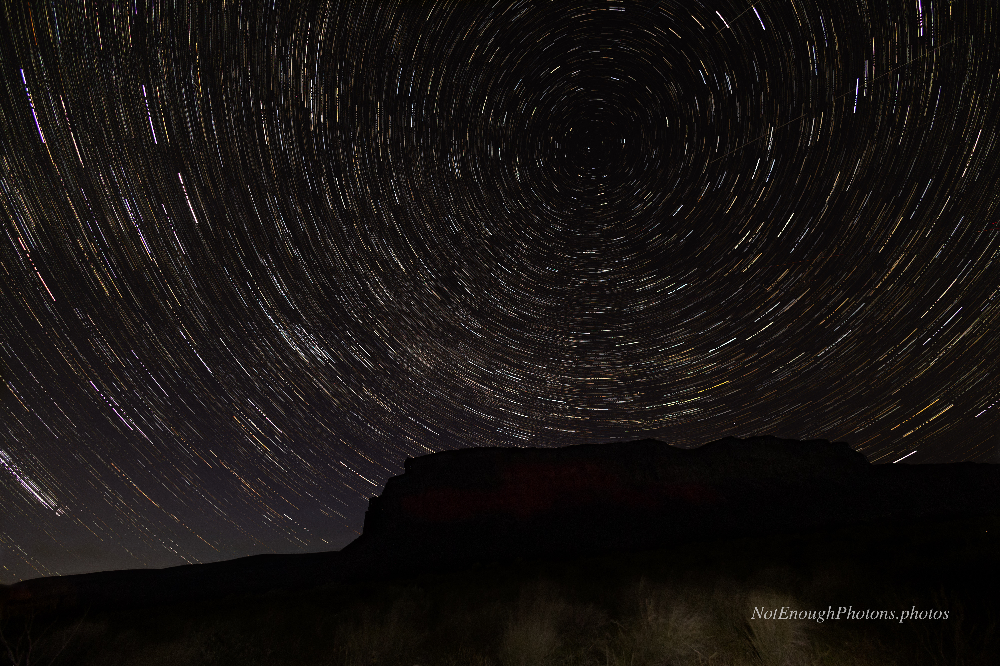

Speaking of Sun Lakes, that's where I created this star trails image with Umatilla Rock in the foreground. It was my second or third attempt at a star trails image, and the first I was reasonably happy about.

These images are made by stacking lots of individual images together, as in the comet picture before. But there's a difference in the kind of stacking involved, and this is reflected in the amount of work needed to produce the final composite image.

In the case of stacking the comet, the pixels are averaged together; this removes transient, extraneous noise from the image. And for the purposes of this discussion, planes and satellites are "extraneous noise." 

In a star trails image, a transient light pixel isn't noise, it's a precious snapshot of the ancient cosmos. So at the end of stacking a star trails image, you'll find you have also preserved a record of the universe beyond as it moves through space and time, but also every commuter flight and Starlink satellite that passed by while you were running your camera. You can either erase them all in the final image -- which is hard to do without also messing up the star trails -- or you'll need to go through each individual image and erase the plane and satellite trails first. Which is a lot of work! Ask me how I know!

Anyway, I think star trail images are beautiful, but I don't think I'll be doing a ton of these.

:::details-box
Unmodified Canon R8, Canon RF 16mm f/2.8 STM lens. 101 images of 25-second exposures, for a total integration time of 42 minutes. Processed in Photoshop.
:::

